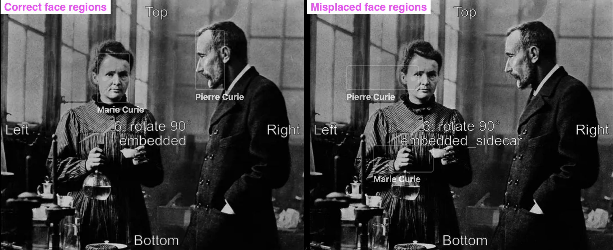

# image-orientation-vs-face-regions

[Images](./images) to test handling of face regions against various photo orientations and metadata locations.

Use case 1. Validating how a photo management app handles Region coordinates against (1) non-default EXIF Orientation and (2) various metadata locations (embedded, sidecar, embedded+sidecar).

Use case 2. Handling of the Orientation tag alone (ignoring the faces/regions stuff).

## How to use

1. Download the test images from the `images` directory.
2. Open the images in your app with faces/people support.
3. Check that the face regions are properly located over the faces in the images.
4. Check that the images has proper orientation and aspect ratio.

## Example

On the left: correct face regions for `photo.6.embedded.jpg` with orientation=6 and orientation+regions metadata defined in the image only.

On the right: misplaced face regions for `photo.6.embedded_sidecar.jpg` with orientation=6 and orientation+regions metadata defined both in the image and sidecar.

## How to generate test images

1. Prepare/have an image with MWG Regions defined in the image metadata and with default EXIF orientation (1 or absent).
2. Put the image(s) into the `input` directory.
3. Run `sh gen.sh` to generate test images.
4. Check the `images` directory for generated files.

The script should work in shells: bash, zsh.
