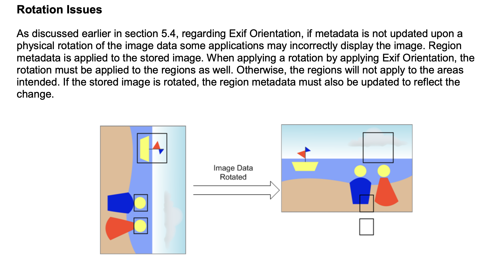

# EXIF orientation vs XMP face regions - example images

[JPEG images](./images) to test handling of face regions against various photo orientations and metadata locations.

Use case 1. Validating how a photo management app handles Region coordinates against (1) non-default EXIF Orientation and (2) various metadata locations (embedded, sidecar, embedded+sidecar).

Use case 2. Handling of the Orientation tag alone (ignoring the faces/regions stuff).

## TOC

<!-- TOC -->

- [How to use](#how-to-use)
- [Example](#example)
- [How to generate test images](#how-to-generate-test-images)
- [Context](#context)
- [Metadata guidelines](#metadata-guidelines)
- [Links](#links)

<!-- /TOC -->

## How to use

1. Download the test images from the [images](./images) directory.
2. Open the images in your app with faces/people support.
3. Check that the face regions are properly located over the faces in the images.
4. Check that the images have proper orientation and aspect ratio.

## Example

On the left: correct face regions for [photo.6.embedded.jpg](./images/photo.6.embedded.jpg) with orientation `6` and orientation+regions metadata defined in the image only.

On the right: mispositioned face regions for [photo.6.embedded_sidecar.jpg](./images/photo.6.embedded_sidecar.jpg) with orientation `6` and orientation+regions metadata defined both in the image and the sidecar [photo.6.embedded_sidecar.jpg.xmp](./images/photo.6.embedded_sidecar.jpg.xmp).


### EXIF/XMP

Metadata from `photo.6.embedded_sidecar.jpg` and `photo.6.embedded_sidecar.jpg.xmp`. Note that the image has `IFD0:Orientation` and the sidecar has `XMP-tiff:Orientation`.

```sh
exiftool -struct -j -a -G1 -Orientation -RegionInfo \
  images/photo.6.embedded_sidecar.jpg \
  images/photo.6.embedded_sidecar.jpg.xmp
```

<!-- prettier-ignore -->
```json
[{
  "SourceFile": "images/photo.6.embedded_sidecar.jpg",
  "IFD0:Orientation": "Rotate 90 CW",
  "XMP-mwg-rs:RegionInfo": {
    "AppliedToDimensions": {
      "H": 700,
      "Unit": "pixel",
      "W": 840
    },
    "RegionList": [{
      "Area": {
        "H": 0.11,
        "Unit": "normalized",
        "W": 0.20,
        "X": 0.31,
        "Y": 0.63
      },
      "Name": "Marie Curie",
      "Type": "Face"
    },{
      "Area": {
        "H": 0.10,
        "Unit": "normalized",
        "W": 0.24,
        "X": 0.24,
        "Y": 0.31
      },
      "Name": "Pierre Curie",
      "Type": "Face"
    }]
  }
},
{
  "SourceFile": "images/photo.6.embedded_sidecar.jpg.xmp",
  "XMP-tiff:Orientation": "Rotate 90 CW",
  "XMP-mwg-rs:RegionInfo": {
    "AppliedToDimensions": {
      "H": 700,
      "Unit": "pixel",
      "W": 840
    },
    "RegionList": [{
      "Area": {
        "H": 0.11,
        "Unit": "normalized",
        "W": 0.20,
        "X": 0.31,
        "Y": 0.63
      },
      "Name": "Marie Curie",
      "Type": "Face"
    },{
      "Area": {
        "H": 0.10,
        "Unit": "normalized",
        "W": 0.24,
        "X": 0.24,
        "Y": 0.31
      },
      "Name": "Pierre Curie",
      "Type": "Face"
    }]
  }
}]
```

## How to generate test images

1. Prepare an image with MWG Regions defined in the image metadata and with default EXIF orientation (`1` or absent).
2. Put the image(s) into the `input` directory.
3. Run `sh gen.sh` to generate test images.
4. Check the `images` directory for generated files.

The script should work in shells: bash, zsh.

## Context

For my self-hosted photo storage I use [PiGallery2](https://github.com/bpatrik/pigallery2/) and [Immich](https://github.com/immich-app/immich). They are awesome, really! In particular, they work with face metadata.
At some point I ran face detection and recognition (Digikam/Mylio) and saved the faces metadata to XMP sidecars. Recently, while viewing the photos in PiGallery2 and Immich I noticed that some face thumbnails actually do not contain faces; instead they are kind of a random piece of a photo. Only photos in vertical/portrait orientation are affected. So what happened? Why wrong face regions in vertical orientation?
Turns out that both apps do not rotate the face regions while correctly rotating the image itself (according to its EXIF orientation). Though underlying issues were quite different:

- Immich (v1.129.0) does not take EXIF orientation into account when loading/processing the region metadata
- PiGallery2 (2.0.3-edge c5c7df0) correctly rotates the image and face regions according to the EXIF `IFD0:Orientation` tag. But it works only for embedded metadata. When loading face regions from XMP sidecar, orientation is ignored and face regions are not rotated, thus causing discrepancy with the rotated image.

## Metadata guidelines

Per [MWG Guidelines for Handling Image Metadata version 2.0](https://web.archive.org/web/20180919181934/http://www.metadataworkinggroup.org/pdf/mwg_guidance.pdf):

> Region metadata is applied to the stored image. When applying a rotation by applying Exif Orientation, the rotation must be applied to the regions as well. Otherwise, the regions will not apply to the areas intended.



Side note: similar issues may arise when applying other operations, such as cropping and resizing.

## Links

- https://web.archive.org/web/20180919181934/http://www.metadataworkinggroup.org/pdf/mwg_guidance.pdf MWG spec (page 39 "5.4 Orientation", page 51 "5.9 Image Region Metadata")
- https://github.com/kvalev/photoprism/pull/59 Import face region metadata (see "Sources" section for more links)
- https://bugs.kde.org/show_bug.cgi?id=286529 Face tag rectangles not adjusted after to apply aspect ratio crop tool (Digikam open issue)
- https://bugs.kde.org/show_bug.cgi?id=455876 Handling of image orientation in modern image formats using ExifTool (Digikam fixed issue)
- https://bugs.kde.org/show_bug.cgi?id=429219 MWG "Applied To" state (mwg-rs:AppliedToDimensions XMP tag) is not included when writing Face metadata to file - Use ExifTool (Digikam fixed issue)
- https://github.com/recurser/exif-orientation-examples EXIF Orientation-flag example images
- https://github.com/immich-app/test-assets/pull/7 the base image with face regions courtesy of [@bugfest](https://www.github.com/bugfest)
